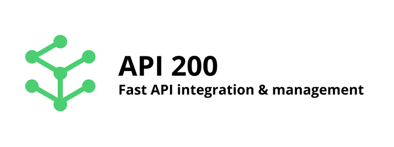
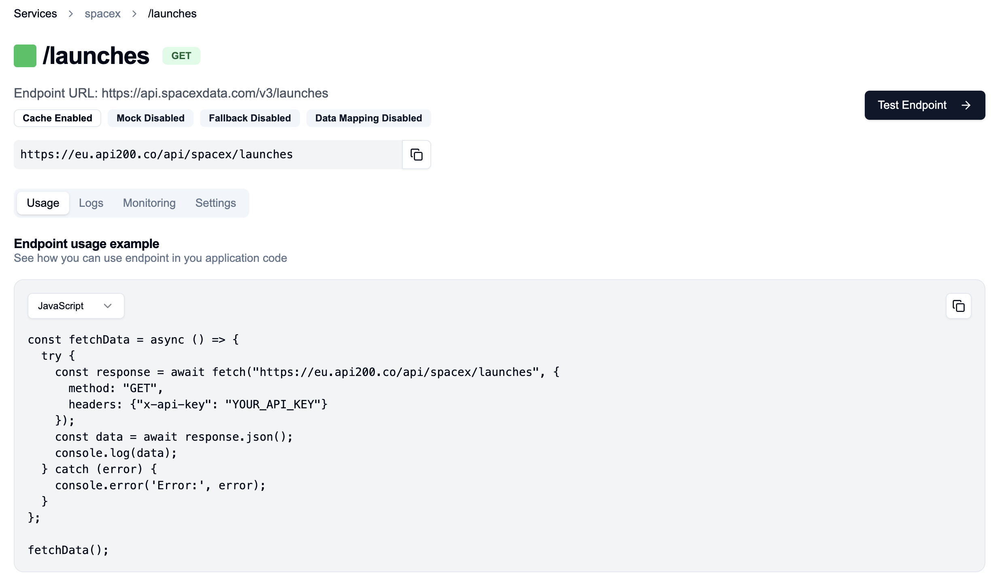

<p align="center" style="margin-top: 20px">
    The Open Source API Integration Platform.
    <br>
    <a href="https://documenso.com"><strong>Learn more »</strong></a>
    <br />
    <br />
    <a href="https://api200.co">Website</a>
    ·
    <a href="https://github.com/API-200/api200/issues">Issues</a>
    ·
    <a href="https://github.com/API-200/api200/wiki/Roadmap">Roadmap</a>
</p>

## About API 200

API 200 is all-in-one gateway for managing third-party APIs efficiently. Integrate third-party APIs or setup MCP server in minutes with
auto-generated code, docs, auth, caching and error handling – so you can focus on what really matters.

<div align="center">
  
</div>

## Key Features

✅ **Fast API Setup:**

- Authentication management
- Response caching
- Automatic retries
- Mock responses
- Response transformation
- Fallback responses
- Custom headers

✅ **Schema Watching:** Get notified when one of your APIs changes response schema

✅ **Incident Detection:** Dedicated tab for incidents automatically detected by the system

✅ **In-browser Swagger Integration**

✅ **Import Endpoints** from OpenAPI and Postman

✅ **Endpoint Monitoring:** Convenient charts with your endpoint's statistics

✅ **Comprehensive Logging**

✅ **MCP Support** ([read more](https://github.com/API-200/api200/blob/main/packages/mcp/README.md))

### Features in Progress:

- More authentication methods

[//]: # (## Interactive Demo)

[//]: # ()

[//]: # (Try out our interactive demo to see API 200 in action: [Try Demo]&#40;PLACEHOLDER_DEMO_LINK&#41;)

## Quickstart

Get started immediately with our managed version of API 200. Users can go to our cloud platform and start integrating
API endpoints instantly without any setup or infrastructure management. Visit [API200.co](https://api200.co) to begin.

## MCP

To configure the API200 MCP server with Claude Desktop (or any other client):

1. Open Claude Desktop settings
2. Navigate to Developer settings
3. Add a new custom tool with the following configuration:

```json
{
  "mcpServers": {
    "api200": {
      "command": "npx",
      "args": [
        "api200-mcp@latest"
      ],
      "env": {
        "USER_KEY": "your-api-key-here"
      }
    }
  }
}
```

## Self-Hosted Setup

### Prerequisites

- Docker
- Docker Compose
- Node.js
- npm

### Installation

```bash
# Clone the repository and install dependencies
git clone https://github.com/API-200/api200-selfhosted
cd api200-selfhosted
npm i

# Run setup script
# For localhost (admin privileges recommended):
sudo node setup.js
# OR for non-localhost:
node setup.js

# Start services
docker-compose up -d
```

> **⚠️ Note:** Localhost setup requires host file modification (`127.0.0.1 kong`), needing admin privileges.

### Access Your Installation

- Frontend: `http://<your-hostname-or-ip>:3000`
- API Handler: `http://<your-hostname-or-ip>:8080`

## Community and Support 🤝

- Check out the [Discussions](https://github.com/API-200/api200/discussions) for ideas and feedback
- Report bugs or request features through [Issues](https://github.com/API-200/api200/issues)
- ⭐ Star our repository to help us raise awareness

## Contact us

For support, custom implementations, or any other inquiries:
[Contact us](mailto:api200contact@gmail.com)

## Tech Stack

<p align="left">
  <a href="https://koajs.com/"></a>
  <a href="https://redis.io/"></a>
  <a href="https://nextjs.org/"></a>
  <a href="https://supabase.com/"></a>
</p>

- Koa - Backend Framework
- Redis - Caching Layer
- Supabase - Database & Auth
- Next.js - Frontend Framework
- shadcn/ui - Component Library

## License

API 200 is licensed under Sustainable Use License. See
the [LICENSE](https://github.com/API-200/api200/blob/main/LICENCE.md) file for more details.
